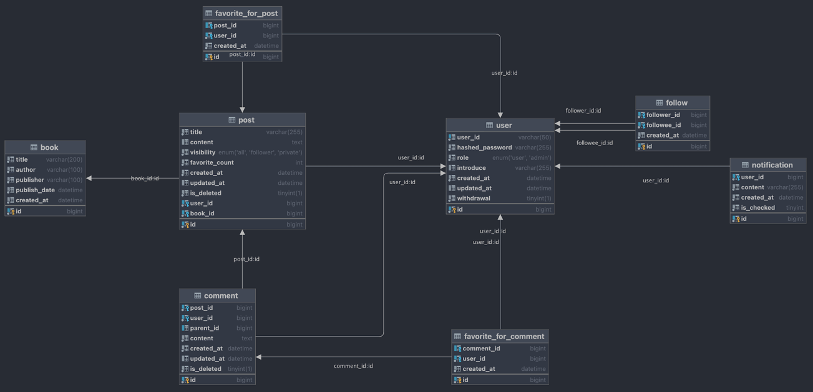
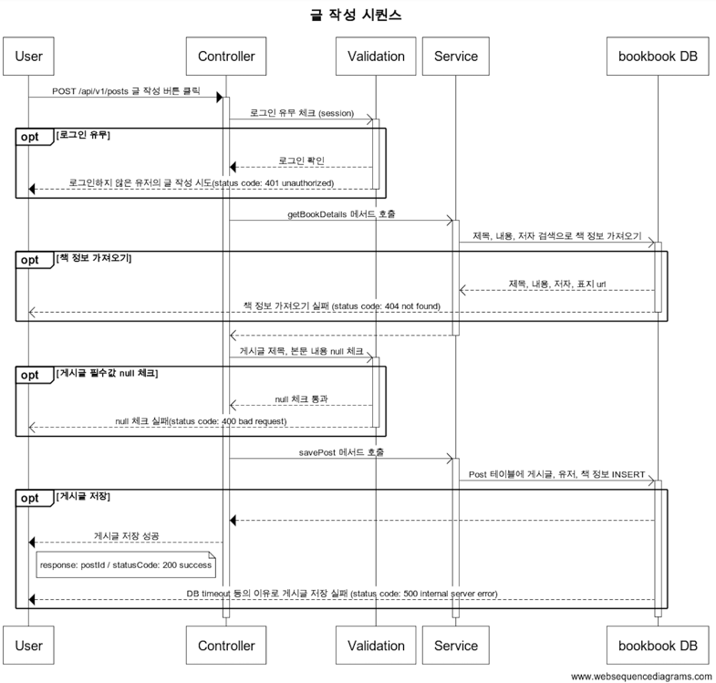
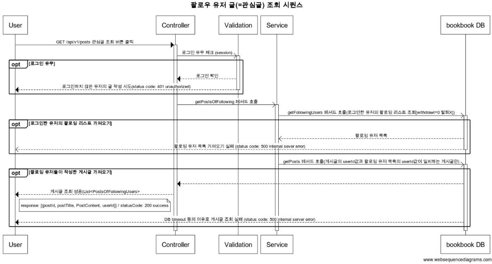

# bookbook-server
- 책을 읽고 생각을 공유하는 SNS 백엔드 서버

## 목적
- SNS 기능들(댓글, 알람, 팔로잉)을 직접 구현함으로써 백엔드 시스템에 대해 이해
- 대용량 트래픽 처리 이해 
- 유지보수 및 가독성을 고려한 코드 작성

## 기술적인 집중 요소
- 라이브러리 및 기능 추가 시 이유 있는 선택과 사용 목적 고려 
- 객체지향의 기본 원리

## 기술 스택
- Java 17, Spring Boot 3.1.1, Gradle, Mybatis, Mysql

## Entity Relationship Diagram (ERD)

## 주요 기능 Sequence Diagram

## 프로젝트 화면 구성도
[카카오 오븐 링크](https://ovenapp.io/project/EqwIwDpbfiX5Xn0w1QlxaYILAlDOyK6e#TBI5C)

## WIKI

    
각종 컨벤션 및 전략

- [코드 컨벤션](https://github.com/ccommit/bookbook/wiki/code-convention)
- [커밋 컨벤션](https://github.com/ccommit/bookbook/wiki/commit-convention)
- [깃 브랜치 전략](https://github.com/ccommit/bookbook/wiki/git-branch-strategy)
- [이슈/PR 템플릿](https://github.com/ccommit/bookbook/wiki/issue-pr-templates)

    
기획

### 도메인

- user
- post
- comment
- follow
- notification
- ranking
--- 
## 유저
- 유저는 북북 서비스를 이용하기 위해 회원 가입과 로그인을 해야합니다.
- 유저는 회원 가입을 위해 nickname, password를 필수로 입력해야 합니다.
    - 한 줄 소개는 선택적으로 입력할 수 있습니다.
- 유저는 고유한 닉네임 값을 갖기 위해 중복 확인을 해야합니다.
- 유저는 회원가입 후에 서비스를 이용하기 위해 로그인을 해야합니다.
- 유저는 로그아웃을 할 수 있습니다.
- 유저가 북북 서비스를 더이상 이용하고 싶지 않을 때 회원 탈퇴를 할 수 있습니다.
- 유저는 글을 작성할 수 있습니다.
    - 유저가 글 작성 시 제목, 내용을 입력할 수 있고 책 제목을 검색해 글에 책 정보를 추가할 수 있습니다.
- 유저는 다른 유저가 작성한 글을 볼 수 있습니다.
- 유저는 탈퇴 후 30일 간 재가입 할 수 없다.
- 유저는 로그인한 후에 아무런 동작이 없는 상태에서 30분이 경과되면 자동으로 로그아웃된다.
- 유저는 회원가입 후 닉네임은 변경할 수 없고, 비밀번호와 한 줄 소개 값은 변경할 수 있다.

### 관리자
- 관리자는 유저의 글과 댓글을 삭제할 수 있다.
- 관리자는 유저가 작성한 글 중 비공개글은 볼 수 없고, 전체 공개, 팔로워 공개 글을 볼 수 있다.

## 글

- 글 작성
    - 글은 작성자가 수정, 삭제할 수 있다.
    - 공개 범위 설정을 할 수 있다.
        - 전체 공개(기본값), 팔로워, 비공개
    - 글 작성 시 반드시 책 정보 검색을 통해 하나의 책을 추가해야 한다.
    - 유저는 글 작성 시 하나의 책에 대해서는 한 번만 글을 작성할 수 있다.
- 글 보기
    - 최신순으로 정렬한다.
    - 글은 좋아요를 할 수 있다.
    - 전체 공개 글 보기와 내가 팔로우하고 있는 유저의 글(관심글)을 나눠서 볼 수 있다.
- 글 검색하기
    - 글(제목, 내용, 작성자), 책(제목,저자, 카테고리) 필터링

## 댓글, 대댓글

- 최신순으로 정렬한다.
- 댓글과 대댓글은 수정,삭제할 수 있다.
- 댓글과 대댓글은 좋아요를 할 수 있다.
- 댓글 삭제 시에도 대댓글은 삭제하지 않는다.
- 대댓글은 1 detph 이다.

## 팔로우
> - 팔로우는 내가 다른 유저의 게시물을 구독하는 것이다.
> - 언팔로우는 내가 다른 유저의 게시물을 구독 취소하는 것이다.
> - 팔로잉은 다른 유저가 내 게시물을 구독하는 것이다.
> - 팔로워는 나를 팔로잉하는 사람이다.
>
- 유저의 닉네임을 검색해 팔로잉 할 수 있다.
- 언팔로잉 할 수 있다.
- 팔로잉 유무를 확인할 수 있다.
- 팔로우 리스트를 조회할 수 있다.
- 팔로잉 리스트를 조회할 수 있다.
- 유저 탈퇴 시 팔로워 리스트와 팔로잉 리스트에서 삭제된다.

## 알림 (푸시 알림 메시지 body를 client에게 주는 api 개발)
- 유저가 게시물을 업로드하면 해당 유저의 팔로워들에게 알림을 보낸다.
- 다른 유저를 팔로우하면 해당 유저에게 알림을 보낸다.
- 유저 본인이 작성한 글에서 본인 이외의 유저가 작성한 댓글/대댓글이 달리는 경우 알림을 보낸다.
- 다른 유저의 글에 작성한 댓글에 대댓글이 달리는 경우 알림을 보낸다.
- 알림을 보낸 시간 기준 일주일 이상 확인하지 않았을 때 재알람을 보낸다.

## **랭킹**
전체 공개글만 포함되며, 좋아요 수와 댓글 수를 고려해서 랭킹이 집계된다.
- 이번주 인기글
- 이번달 인기글

--- 
### 정책
- 비밀번호는 암호화해서 저장한다.
- 게시글 등록 시 사용하는 책 정보는 open api 를 이용해서 미리 저장해둔다. 그리고 주기적으로 새로운 책을 업데이트하는 방식으로 한다.
- 유저, 글, 댓글은 삭제 시 soft delete 처리한다.

